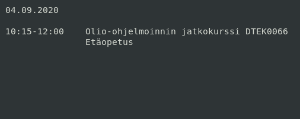
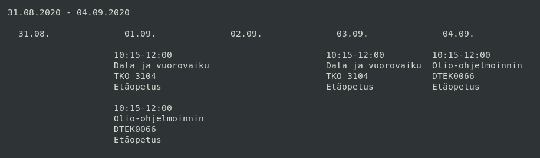
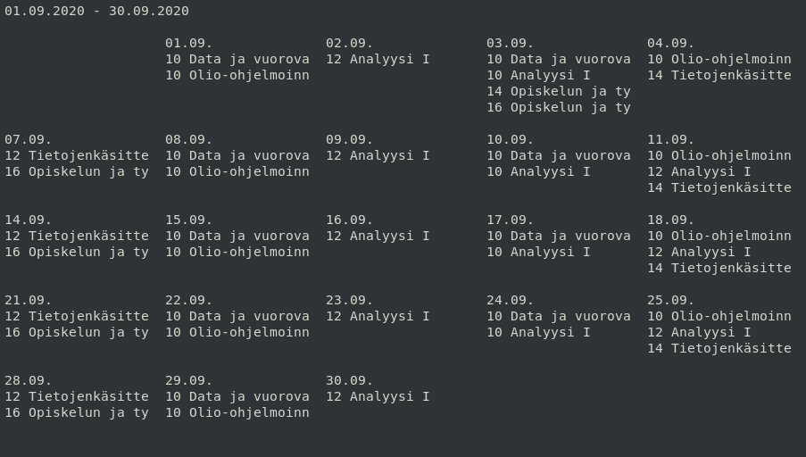

# Utu-lukkari
Utu-lukkari is a small terminal application for showing a school schedule
in calendar format

## Requirements

Utu-lukkari requires python version >= 3.6.
<br />
This is only tested on linux enviroment.

## Getting started

```
# Clone the repo
git clone https://github.com/Nykseli/utu-lukkari
cd utu-lukkari

# Make sure that program is working
./lukkari-test.py

# Then you can run the program with the example lukkari file
./utu-lukkari.py -p lukkari.txt.example
```


## Install / Uninstall
Utu-lukkari is installed with make.
<br />
If you are missing make, install it with
<br />
```
sudo apt-get install make
```

```
# Install
sudo make install
# Then run
utu-lukkari


# Uninstall
sudo make uninstall
```

## Navigation

You can navigate the lukkari application with the following key commands.

| Key | Action | Info |
| --- | ------ | ---- |
| j/Down | Move one link down | Only works in in montly |
| k/Up | Move one link up | Only works in in montly |
| l/Right | Move one link right | Only works in in weekly and montly |
| h/Left | Move one link left | Only works in in weekly and montly |
| Enter | Open the selected link in daily view | - |
| b | Show daily view | - |
| n | Show weekly view | - |
| m | Show monthly view | - |
| o | Previous day/week/month | Previous value is based on the view |
| p | Next day/week/month | Next value is based on the view |
| q | Quit program | - |

## Lukkari file

See the complete [example](lukkari.txt.example)
<br />
By default, the lukkari file is loaded from ~/.config/utu-lukkari/lukkari.txt
<br />
You can also set the path with the `-p` option

### Structure
The lukkari file contains courses and the courses contain three different sections.
<br />
Courses are divided by empty line(s)

* Section 1:
    - The course Id
* Section 2:
    - The name of the course
* Section 3:
    - Lines of the dates and times of the lectures
    - Go to [peppi](https://opas.peppi.utu.fi/), find the course and copy-paste the hours from Teaching (FI: Opetusajat)


## Modes / Views

There are three different modes/views: Daily, Weekly and Monthly

<br />
Daily:



Weekly:



Monthly:



